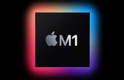
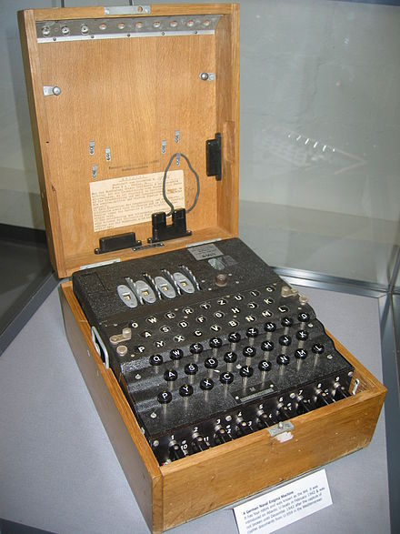

# Kortin-Enigma
 Enigma Simulation and Turing Machine (Bombe)
### Enigma 1.8 - T.E.D - The Enemy Dail - "KOENIG MARTIN" 


```
* Author: Smiril <sonar@gmx.com>
* Based in the code of:
*  capi_x <capi_x@haibane.org>
*  Harald Schmidl <hjschmidl@acm.org>
*  Fauzan Mirza's <fauzan@dcs.rhbnc.ac.uk>

```

## Source

* **[main.m](enigma/enigma/main.m)** 
* **[add.h](enigma/enigma/add.h)**
* **[Makefile](enigma/enigma/Makefile)**

 5 Rotor Enigma Simulation with Bruteforce Message function

 6 versions of one Enigma without Source change

## Options

* --option-[1-6]         <--- the main functions
* --option-[1-6][a/b]    <--- Basic Bruteforce
* --help                 <--- Help Page
* --version              <--- The Version




## Cloning

```
git clone https://github.com/Smiril/Kortin-Enigma.git
```

## Instalation

```
cd Kortin-Enigma/bin
tar -xvzf enigma.tar.gz
sudo cp ./enigma /usr/local/bin/enigma
sudo mkdir -p /usr/local/share/enigma/
sudo cp *.txt /usr/local/share/enigma/

```
